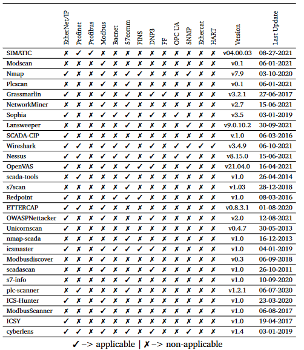

# OT Asset Discovery

## What is Asset Discovery?

Asset discovery and inventory in operational technology (OT) environments refer to the systematic identification, classification, and documentation of all devices and systems connected to an industrial network. This process is crucial for understanding the landscape of OT assets, such as programmable logic controllers (PLCs), human-machine interfaces (HMIs), and sensors.

Asset discovery is essential for maintaining a comprehensive understanding of the network topology, potential vulnerabilities, and ensuring efficient cybersecurity practices. In compliance with legislation and regulations, such as the NIST Cybersecurity Framework and industry-specific standards like IEC 62443, organisations are required to conduct regular asset inventories to enhance security and resilience against cyber threats in OT environments.

An asset inventory typically includes, but is not limited to;&#x20;

* Asset ID
* Asset Type: PLC, HMI etc
* Manufacturer
* IP Address
* MAC Address
* Firmware Version
* Operating System and Version
* Installed Applications and Versions
* Ports
* Protocols


Some of this information may already exist in paper files, spreadsheets, or IT management databases, however in most cases, existing OT asset information is out-of-date and incomplete.


To create an asset inventory, you must be able to detect devices communicating over the OT network, as well as those that may not communicate often or at all, however are still attached to the network. There are many ways to do this, and will depend on the type of environment you are working with. This document will aim to outline the procedures.&#x20;

***

## Current Documentation Review

Before delving into active scanning and network analysis, it's essential to examine existing documentation related to the OT infrastructure. This documentation serves as a foundational reference and can provide valuable insights into the organisation's assets and their configurations.

Begin by reviewing network diagrams, system architecture documentation, and any existing asset inventories. These documents may reveal the initial understanding of the OT landscape, including the types of devices, their interconnections, and the overall network topology. Analysing these documents helps in establishing a baseline understanding of the expected assets within the environment.

Configuration files and historical records, such as change logs and incident reports can also be useful. These sources can uncover details about past and current states of the OT infrastructure, highlighting any modifications or incidents that may have affected the asset landscape.

Engage in discussions to validate the accuracy of the existing documentation and gather insights from individuals with hands-on experience in the OT environment. This collaborative approach ensures a more comprehensive understanding of the network and assists in identifying any discrepancies between the documented information and the actual state of the assets.

## Walking the Floor

"Walking the floor" refers to physically inspecting the OT environment, visiting operational sites, and directly observing the industrial processes and devices in action. This hands-on approach complements the data gathered from documentation and network scans, providing a more holistic view of the operational technology landscape.

During this phase, engage with OT personnel, operators, and maintenance teams to gather insights into the day-to-day operations. Conversations with on-site experts can reveal nuances and details not captured in documentation or network scans. Observing the physical layout of devices, noting equipment labels, and understanding the interconnections between different components contribute to a more accurate asset inventory.

## Passive Listening

SPAN taps, mirror all traffic through specific ports of a router, plug in there and capture all data.&#x20;

## Active Probing

## Software and Firmware Analysis

## Reporting and Documenting

## Taxonomy of Tools

<figure><figcaption>
Samanis, E., Gardiner, J. and Rashid, A. (2022) <em>A taxonomy for contrasting industrial control systems asset Discovery Tools</em>, <em>arXiv.org</em>. Available at: https://arxiv.org/abs/2202.01604 (Accessed: 29 February 2024).
</figcaption></figure>
